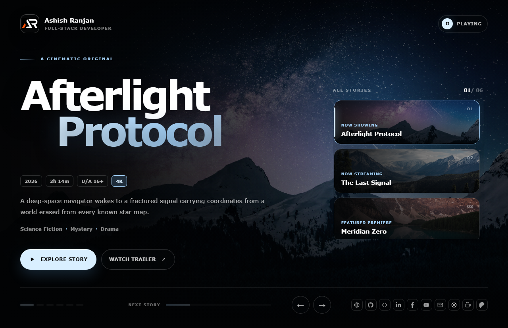

# Cinematic Carousel UI

A responsive React carousel with cinematic imagery, autoplay, keyboard controls, swipe navigation, reduced-motion support, and a developer details modal.



## Features

- Autoplay with pause and resume controls
- Previous, next, keyboard, swipe, and preview navigation
- Responsive cinematic layout with local image assets
- Accessible modal with focus handling and repository activity
- Icon-only social and support links in the footer

## Tech stack

- React and Vite
- styled-components
- React Icons

## Run locally

```bash
npm install
npm run dev
```

Build and deploy to GitHub Pages:

```bash
npm run build
npm run deploy
```

Live app: https://a2rp.github.io/cinematic-carousel-ui/

## Links

- Portfolio: https://www.ashishranjan.net/
- GitHub: https://github.com/a2rp
- CodePen: https://codepen.io/ash1198
- LinkedIn: https://www.linkedin.com/in/aashishranjan
- Facebook: https://www.facebook.com/theash.ashish/
- YouTube: https://www.youtube.com/@ashishranjan-ashz?sub_confirmation=1
- Email: mailto:ash.ranjan09@gmail.com

## Support

- Support: https://a2rp-donation-page.netlify.app/
- Buy Me a Coffee: https://buymeacoffee.com/a2rp
- Patreon: https://patreon.com/a2rp
